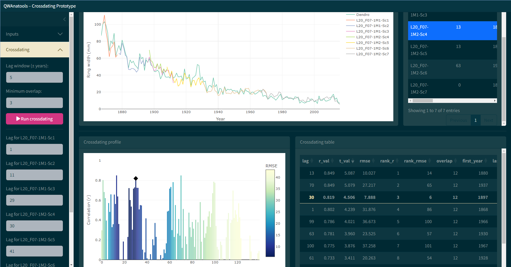

<!-- README.md is generated from README.Rmd. Please edit that file -->

# qwanadate (PROTOTYPE) 

<!-- badges: start -->
<!-- badges: end -->

Quantitative Wood Anatomy dating : Shiny application to interactively
date tree-rings in QWA images

qwanadate is an interactive app designed to help absolute dating of wood
anatomical images analysed with the qwanamiz Python package.

The app is currently a prototype.

## Installation

The app is not yet entirely packaged. You can download the following R
script :

[qwanadate_app](https://github.com/SamBcht/qwanadate/blob/6399f23d712aca2f03e1755e18dd3afe54544f52/inst/app/qwanadate_app.R)

Then open and run it in R or RStudio

You can install the development version of qwanadate from
[GitHub](https://github.com/) with:

``` r
# install.packages("devtools")
devtools::install_github("SamBcht/qwanadate")
```

And launch the app with :

``` r
# run_qwanadate()
```

## Example

Main crossdating window of qwanadate :



## Required inputs

The app requires two types of input data:

### 1. Anatomical ring data

- A **base directory** containing one or more QWAnamiz output folders  
- Each folder must follow the pattern: `<TreeID>..._outputs/`
- Inside these folders, the app expects files named: `*_rings.csv`

These files are automatically detected after entering the **Tree ID**
and selecting the base directory.

------------------------------------------------------------------------

### 2. Reference dendrochronological series

A ring-width file in one of the following formats:

1.  `.csv` file containing:

- `year` → calendar year  
- `TRW` → ring width values  
- `Tree.ID` → tree identifier (optional but recommended)

2.  `.rwl` file (standard dendro format)

The user must also specify the **unit scaling** of the TRW values
(e.g. mm, µm).

------------------------------------------------------------------------

### 3. Tree identifier

- A **Tree ID** must be provided to:
- match anatomical files  
- select the corresponding reference series

If no match is found in the dendro file, the app allows manual
selection.

------------------------------------------------------------------------

## Minimal workflow

1.  Enter **Tree ID**  
2.  Select **base directory** (QWAnamiz outputs)  
3.  Load **reference TRW file**  
4.  Click **“Search files”**  
5.  Run crossdating
6.  Switch to the **Manual Crossdating** window and correct the
    crossdating Anatomical segments can be moved to the desired calendar
    year by clicking on the corresponding bar on the profile plot.
    Alternatively they can be moved by using the `Crossdating` drop-down
    menu on the left
7.  Create the anatomical chronology and verify the alignment under the
    `Validation` window
8.  Specify the place to store the output file and save with the
    drop-down menu on the left
